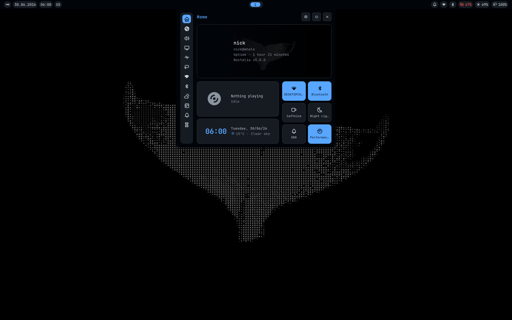

# sysconf

<div align="center">



My NixOS configuration — system settings, packages, and dotfiles

</div>

## Structure

```
sysconf/
├── flake.nix              # entry point, defines every host
├── base/
│   ├── common/
│   │   ├── core.nix       # settings every machine gets, no exceptions
│   │   └── desktop.nix    # shared GUI tools, imported by GUI bases only
│   ├── niri.nix           # Niri + Noctalia compositor setup
│   ├── kde.nix            # KDE Plasma setup
│   └── server.nix         # headless, no DE
├── modules/               # optional feature sets, mix and match per host
│   ├── gaming.nix
│   ├── virtualisation.nix
│   └── creative.nix
├── hosts/
│   └── <hostname>/
│       ├── configuration.nix   # hostname, bootloader, LUKS, user account
│       └── hardware.nix        # auto-generated, don't touch by hand
├── dotfiles/              # home-manager config: nvim, niri, ghostty, etc.
└── setup/
    └── bootstrap.sh       # installer for new machines
```

## How it's organized

`base/common/core.nix` covers whatever every machine needs

`base/` is where the machine type is decided — exactly one base is selected per host

`modules/` is the opt-in layer above that. Things like Steam or virtualisation live there, and a host only picks them up if it declares them in `flake.nix`

`hosts/<name>/` holds only what's specific to that one machine — hostname, disk encryption UUIDs, bootloader

## Installing on a new machine

1. Install NixOS — partition, encrypt the disk if you want, create a temporary user, reboot into the fresh system.
2. Clone the repo:
   ```bash
   nix-shell -p git --run "git clone https://github.com/ERVELYUS/sysconf.git ~/sysconf"
   ```
3. Run the installer:
   ```bash
   bash ~/sysconf/setup/bootstrap.sh
   ```
   It'll ask for a hostname, username, password, and which profiles you want. It detects disk encryption on its own and offers to change the LUKS password if needed. From there it builds a new `hosts/<hostname>/` directory, wires it into the flake, and runs the first switch.
4. Reboot. Everything's live — packages, niri, dotfiles, theming.

## Aliases

| Alias | What it does |
|---|---|
| `os-switch` | rebuild and switch (`nh os switch`) |
| `os-update` | update all flake inputs, then rebuild and switch |
| `os-clean` | clean old generations, keep the last 4 |

## Adding a host by hand
 
```bash
mkdir ~/sysconf/hosts/<newhost>
cp /etc/nixos/hardware-configuration.nix ~/sysconf/hosts/<newhost>/hardware.nix
# write configuration.nix following one of the existing hosts as a template
```
 
then add it to `flake.nix`:
 
```nix
<newhost> = mkHost {
  hostname = "<newhost>";
  username = "<user>";
  base = "niri";         # or kde / server
  modules = [ "gaming" ];  # or [ ] for none
};
```
 
```bash
sudo nixos-rebuild switch --flake ~/sysconf#<newhost>
```
